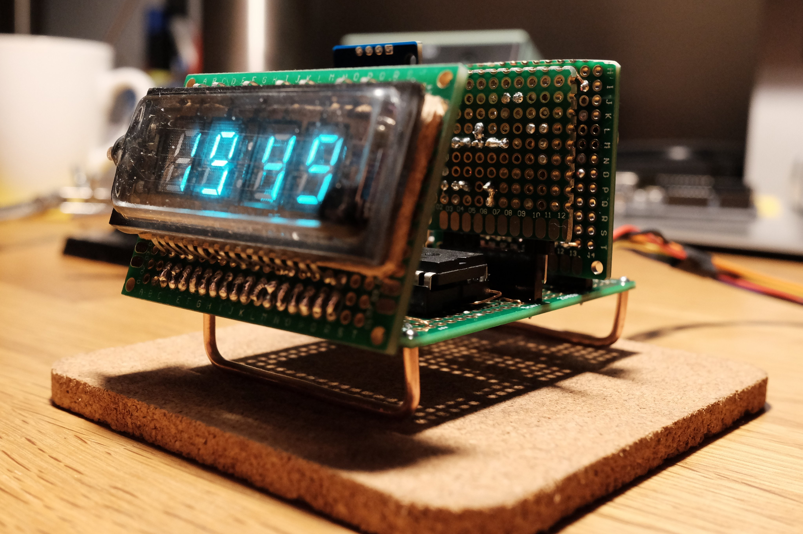

# chronovfd

This project is still a work-in-progress.

The first version was built completely on protoboard and can be seen
on [my Twitter](https://twitter.com/ansemjo/status/1235315817937596424).

## VFD Driver PCB

This is basically the Universal VFD PSU by Rolo Kamp on a board together
with a Microchip HV5128 driver. It's the "front plate" for the clock.

KiCad project in `hardware/vfddriver.pro`.

