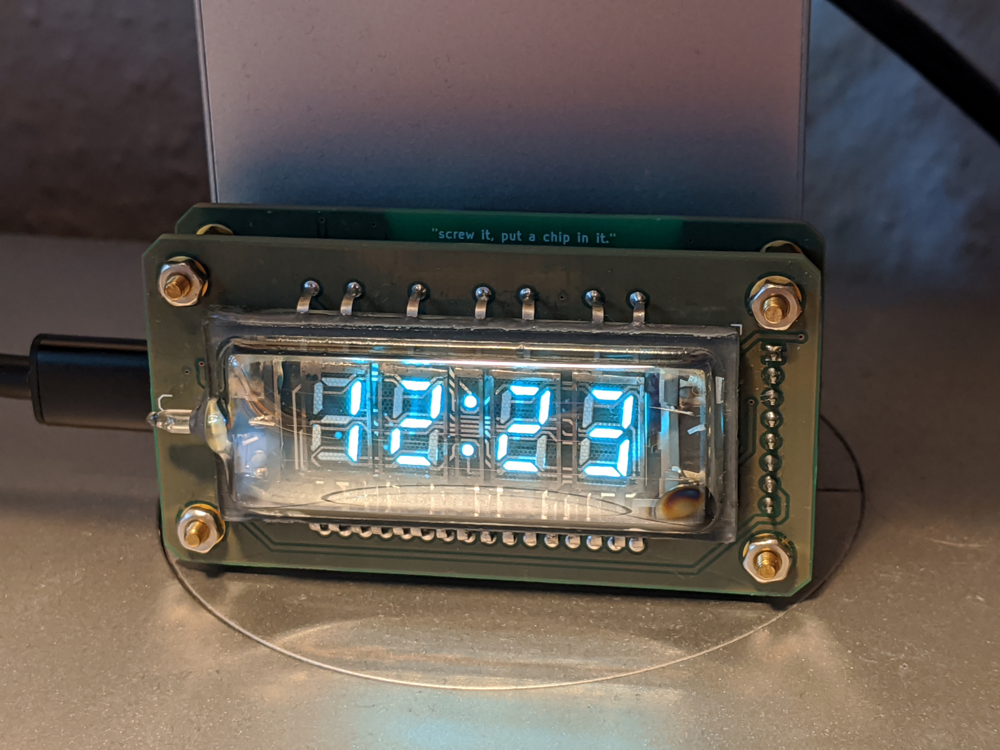
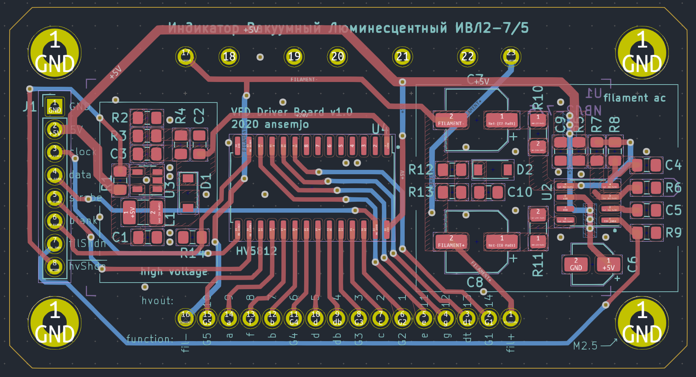
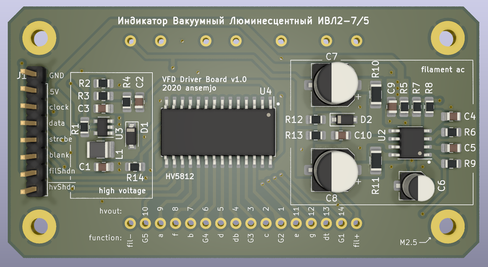
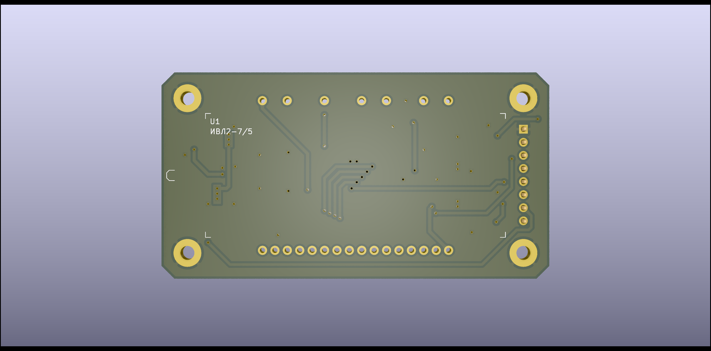
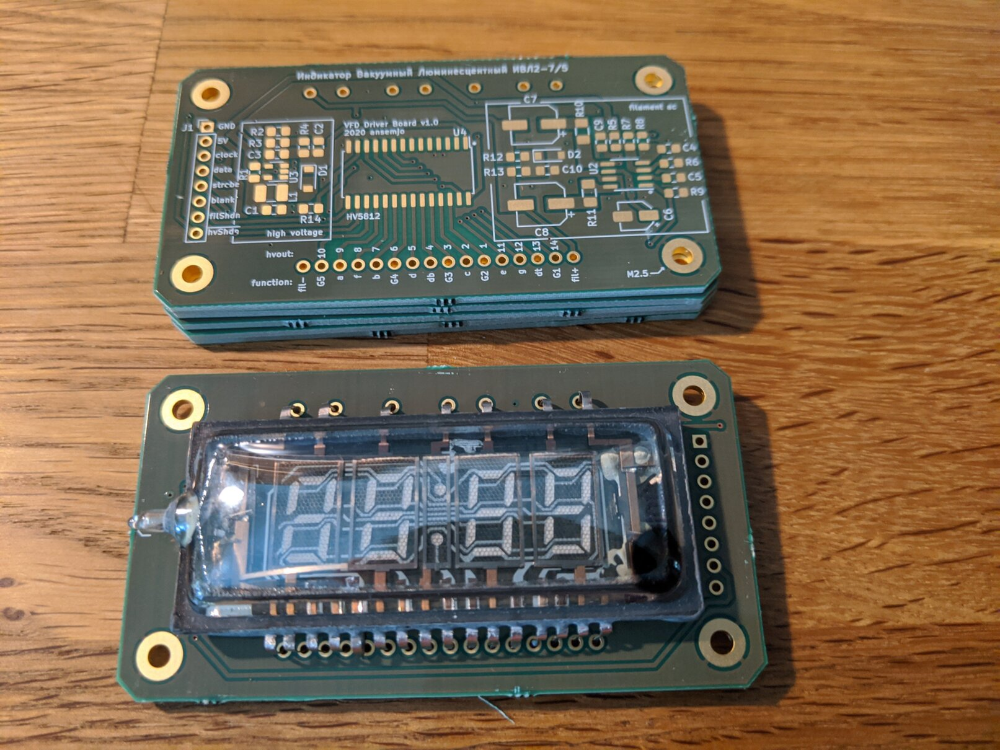
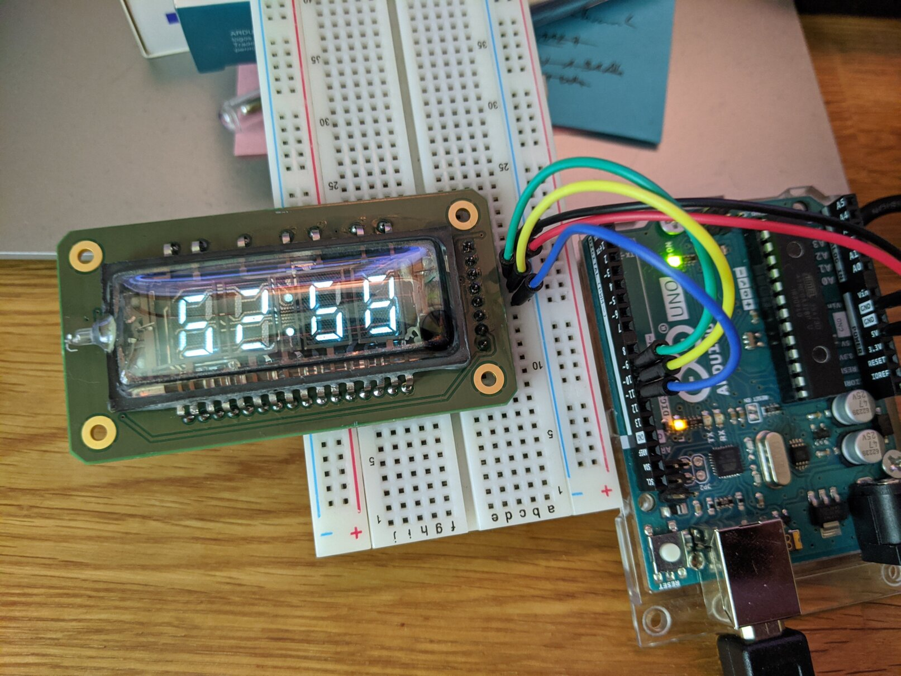
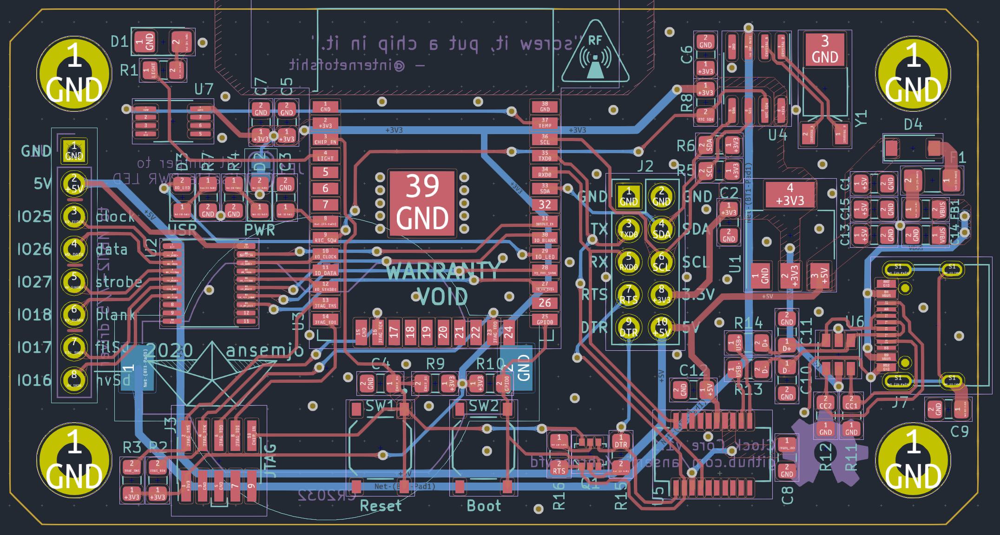
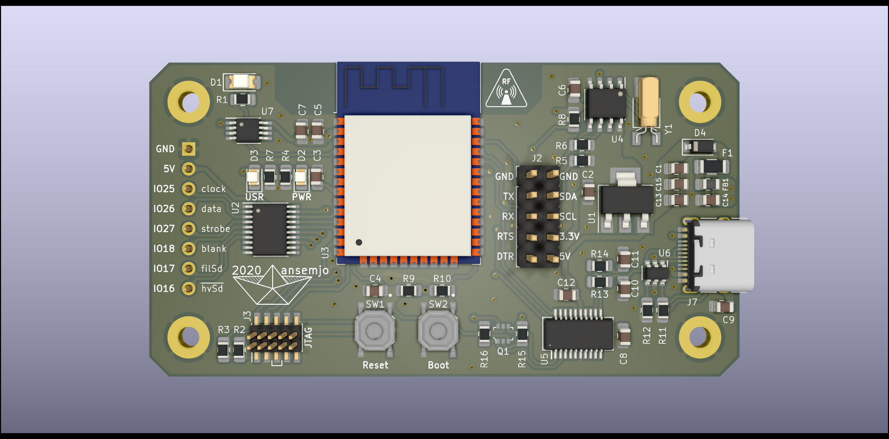
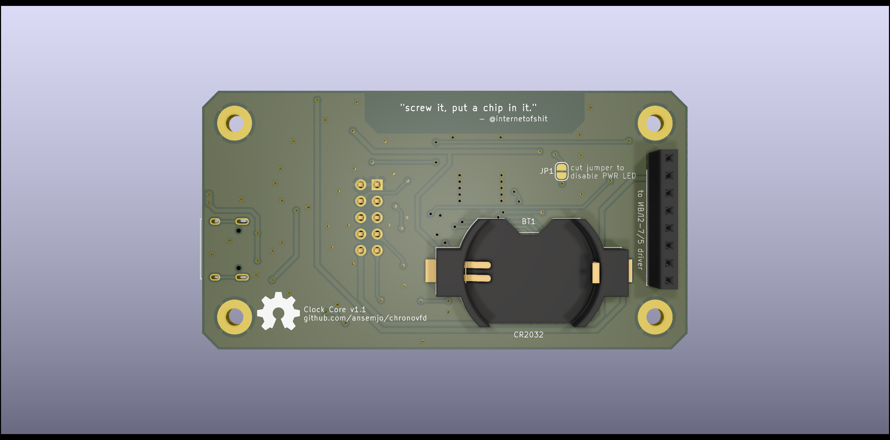

# chronovfd

This project is still a **work-in-progress**.

The first prototype was built completely on protoboard and can be seen
on [my Twitter](https://twitter.com/ansemjo/status/1235315817937596424).

Currently, I have the printed circuit boards assembled and the display lights
up but I need some more work on the firmware until it actually performs any
useful function.

# Hardware

* [VFD Driver](#vfd-driver-board)
* [Clock Core](#clock-core)

The boards were designed with KiCad version 5.1.6.

The bill-of-materials files contain Digi-Key part numbers, so you can easily
import all parts into your cart. Only the IVL2-7/5 display itself needs to be
sourced elsewhere but there are plenty on [eBay](https://www.ebay.com/sch/i.html?_nkw=ivl2-7%2F5).

Both boards can be assembled together e.g. with 11 mm M2.5 standoffs between
them. I have found some that are marketed as a "Raspberry Pi assembly kit".

### Errata

Sometimes things go wrong .. these are known errors and how to fix them:

* [Rev1.0: Fix the ambient light sensor photodiode](hardware/errata/rev1.0-photodiode/erratum-photodiode.md)

## VFD Driver Board

The VFD driver board is basically a power supply and a simple shift register
with a high-voltage capable output side. I used Rolo Kamp's *Universal VFD PSU*
design from [this EEVblog forum post](https://www.eevblog.com/forum/projects/showing-my-vfd-psu/).
The original [schematics](research/universal-vfd-psu/schematic_r2.1.pdf) and
a few pictures are mirrored in `research/universal-vfd-psu/`.

It can be used standalone but there is no logic on the board, so you'll have
to implement time multiplexing for the digits yourself. See the
[Microchip HV5812 datasheet](http://ww1.microchip.com/downloads/en/DeviceDoc/20005629A.pdf)
for more information. The gist is:

* supply regulated 5V power on `GND` / `5V`
* data is transmitted over `clock` and `data` with SPI mode 0 transactions at 5 MHz
* the output pin numbers are listed with their segment or grid function on the silkscreen
* toggle the `strobe` pin `HIGH` to latch the data to the high voltage outputs
* pulling the `filShdn` pin `HIGH` disables the filament supply
* pulling the `hvShdn` pin `LOW` disabled the high-voltage supply
* when the shutdown pins are left floating / in high-Z state, they are pulled active internally, so the display is "on"
* PWM dimming the brigthness with the filament shutdown pin is possible

### Design files

| type | file |
| ---- | ---- |
| kicad project | `hardware/vfddriver.pro` |
| schematic | [`hardware/vfddriver.pdf`](https://github.com/ansemjo/chronovfd/raw/master/hardware/vfddriver.pdf) |
| bill of materials | [`hardware/vfddriver_bom.csv`](hardware/vfddriver_bom.csv) |
| interactive bom | [`hardware/vfddriver_ibom.html`](https://raw.githack.com/ansemjo/chronovfd/master/hardware/vfddriver_ibom.html) |

### Images

## Clock Core

The Clock Core board is the control logic for this clock project. If you look
at the bill of materials it is a relatively expensive board for what it's
supposed to do but I wanted to experiment with some of these components. On
this board there are:

* an Espressif `ESP32-WROOM-32` module, which has WiFi and Bluetooth connectivity
* a USB 2.0 Type-C receptacle for power and data with relatively good input protections and a 3.3V linear regulator
* an FTDI `FT231XS` with an auto-reset circuit providing a serial programming and communication interface to the ESP32
* a Maxim `DS1338Z-33+` RTC with a crystal, which is connected to the ESP32 over I²C and has a coin cell battery backup
* a Maxim `DS18B20U` temperature sensor with a OneWire interface
* a footprint for a photodiode to sense ambient light levels
* a Texas Instruments `SN74HCT245PWR‎` level shifter to provide the correct logic levels to the VFD driver board
* a PWR and a USR LED for that blinkenlights, the PWR LED can be disabled by cutting a solder jumper
* a 10-pin 1.27mm JTAG header for the ESP32

### Design files

| type | file |
| ---- | ---- |
| kicad project | `hardware/clockcore.pro` |
| schematic | [`hardware/clockcore.pdf`](https://github.com/ansemjo/chronovfd/raw/master/hardware/clockcore.pdf) |
| bill of materials | [`hardware/clockcore_bom.csv`](hardware/clockcore_bom.csv) |
| interactive bom | [`hardware/clockcore_ibom.html`](https://raw.githack.com/ansemjo/chronovfd/master/hardware/clockcore_ibom.html) |

### Images

