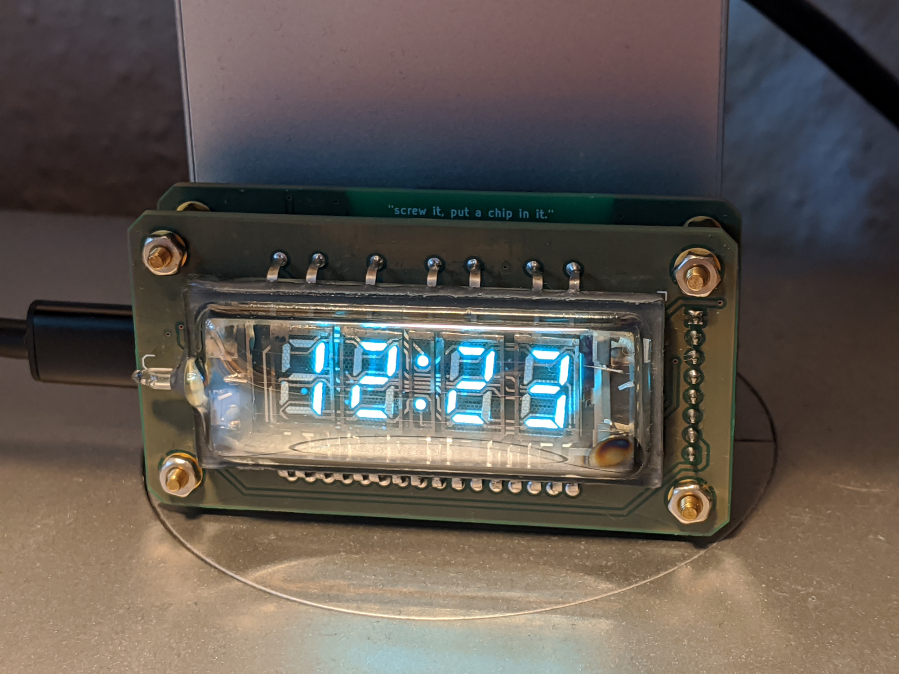

# chronovfd

A vacuum-flourescent display clock project based on Soviet NOS [IVL2-7/5 / ИВЛ2-7/5](https://www.ebay.com/sch/i.html?_nkw=ivl2-7%2F5) tubes.

This has been my first somewhat complex hardware project when I got into electronics design in 2020. What you see in the picture below is the original "sandwich design" with a pure-logic display driver and an ESP32-based design for the controller board. You can find all the KiCAD files and firmware for it in [`sandwich/`](sandwich/), together with the original README and more photos.

The above design of course still works but I found it needlessly complex later on. Primarily because the as the mapping of display characters to segment anodes, as well as the required anode and grid time-multiplexing, needed to be implemented on the controller board. Which meant that you couldn't easily swap out the controller for something else. It had been a design goal not to require any firmware for the display originally but I realized that just lead to more problems down the line. Instead, I opted to include a small ATtiny414, simplify the high-voltage circuit and implement it all as an I2C peripheral. That design can be found in [`vfddriver/`](vfddriver/).

*This README is currently a work-in-progress, as I tidy up the repository.*