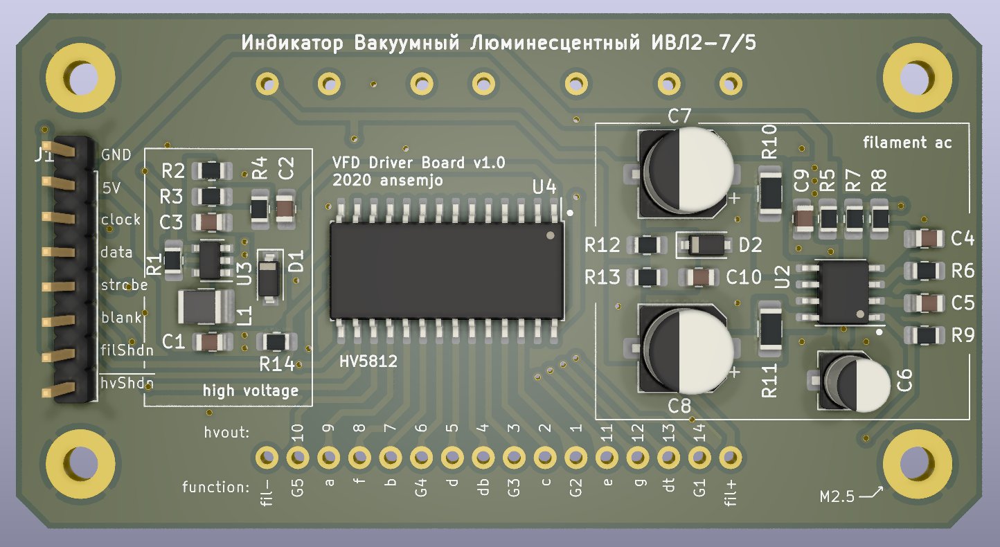
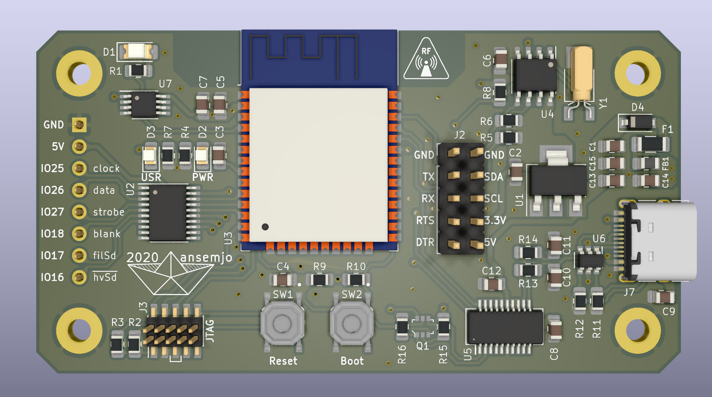
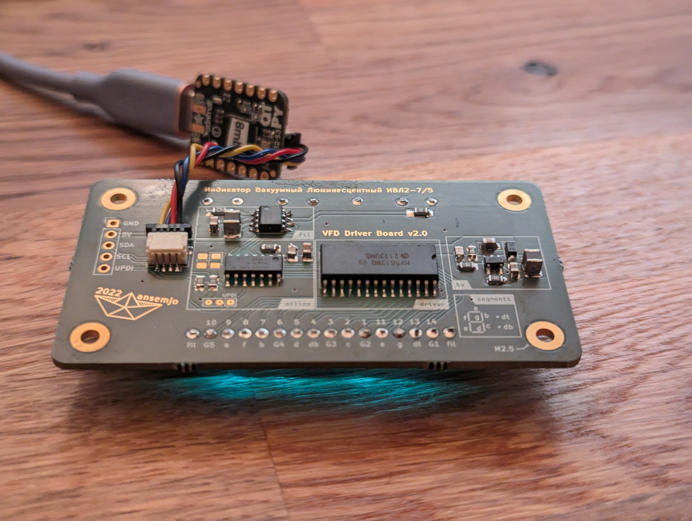
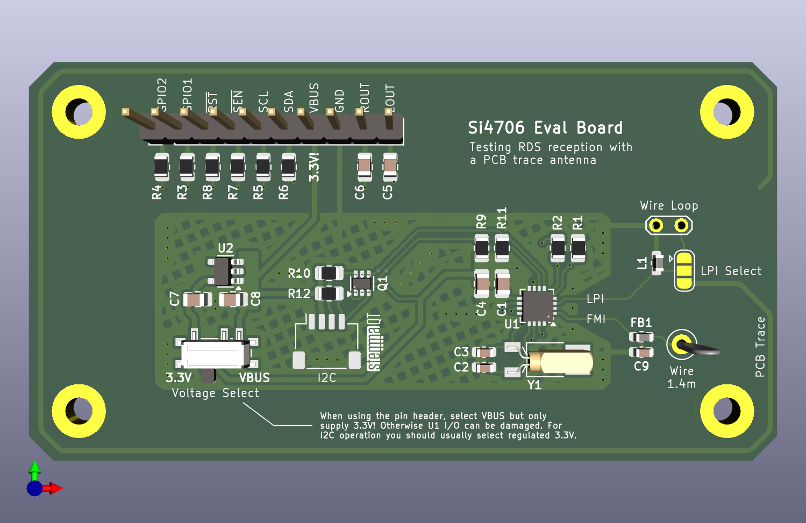

# chronovfd

A vacuum-flourescent display clock project based on Soviet NOS [IVL2-7/5 / ИВЛ2-7/5](https://www.ebay.com/sch/i.html?_nkw=ivl2-7%2F5) tubes. This has been my first somewhat complex hardware project when I got into electronics design in 2020 and grew to multiple iterations over the years.

### sandwich

What you see in the picture below is the original "sandwich design" with a pure-logic display driver (more or less a wrapper around the shift-register) and an ESP32-based design for the controller board. You can find all the KiCAD files and firmware for it in [`sandwich/`](sandwich/), together with the original README and more photos.

### vfddriver v2

The above design of course still works but I found it needlessly complex later on. Primarily because the mapping of display characters to segment anodes, as well as the required anode and grid time-multiplexing, needed to be implemented on the controller board. Which meant that you couldn't easily swap out the controller for something else. It had originally been a design goal not to require any firmware for the display but I realized that just lead to more problems down the line. Instead, I opted to include a small ATtiny414, simplify the high-voltage circuit and implement it all as an I2C peripheral. **That design, along with firmware and documentation, can be found in [`vfddriver/`](vfddriver/).**

In these images above you can see why there is no dedicated "clockdriver v2" yet: now that it is controlled over I2C, you can just use a small CircuitPython board with a Qwiic cable, like the [Adafruit QT Py ESP32-S3](https://www.adafruit.com/product/5426). :)

### other directories

The **[research/](research/) directory** contains a lot of initial ideas and fundamental information on VFD operation (needed voltages etc.) along with the [display datasheets](research/ivl2-7_5-datasheets).

The first **prototype clock** on perfboard can be found in [research/protoclock/](research/protoclock/).

An alternative **LCD-based front panel** with compatible dimensions, which can also be used standalone in [lcddriver](lcddriver/).

In [experiments/si4706_radio_eval](experiments/si4706_radio_eval/) there is an evaluation board based on the **Skyworks Si4706 FM receiver** with RDS decoding. The idea is that you should be able to get time signal from radio stations without any need for internet synchronization.

