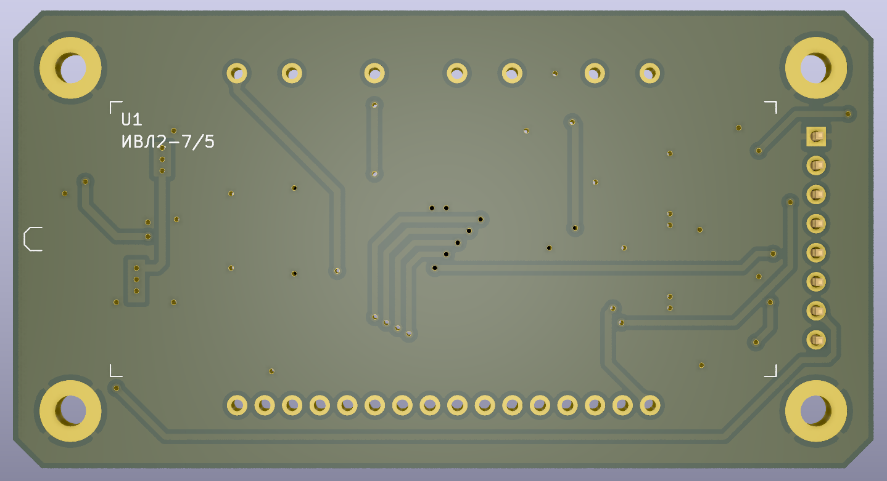
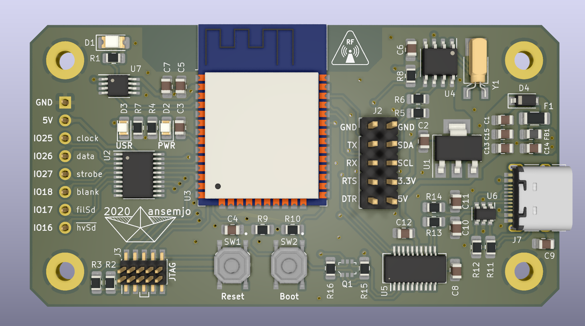

# chronovfd

~~ *a vacuum-flourescent display clock project* ~~

The first prototype of this clock was built completely on protoboard and can be
seen on [my Twitter](https://twitter.com/ansemjo/status/1235315817937596424).

This has become my first somewhat complex hardware project and as of now I have
assembled multiple printed circuit boards for the "display driver" and the
"clock core". After fiddling with Espressif's development framework for a while
the assembled hardware now actually works as a clock with internet time
synchronization. :)

You'll find:

* some initial research and ressources on the topic in `research/`
* [hardware](#hardware) files in `hardware/`
* the [firmware](#firmware) in a PlatformIO project in `firmware/`

# Hardware

As mentioned above the final assembly consists of two sandwiched boards:

* [VFD Driver](#vfd-driver-board)
* [Clock Core](#clock-core)

The boards were designed with KiCad version 5.1.6.

The bill-of-materials files contain Digi-Key part numbers, so you can easily
import all parts into your cart. Only the IVL2-7/5 display itself needs to be
sourced elsewhere but there are plenty on [eBay](https://www.ebay.com/sch/i.html?_nkw=ivl2-7%2F5).

Both boards can be screwed together e.g. with 11 mm M2.5 standoffs between
them. I have found some that are marketed as a "Raspberry Pi assembly kit" that
fit well.

### Errata

Sometimes things go wrong .. these are known errors and how to fix them:

* [Rev1.0: Fix the ambient light sensor photodiode](hardware/errata/rev1.0-photodiode/erratum-photodiode.md)

## VFD Driver Board

The VFD driver board is basically a power supply and a simple shift register
with a high-voltage capable output side. I used Rolo Kamp's *Universal VFD PSU*
design from [this EEVblog forum post](https://www.eevblog.com/forum/projects/showing-my-vfd-psu/).
The original [schematics](research/universal-vfd-psu/schematic_r2.1.pdf) and
a few pictures are mirrored in `research/universal-vfd-psu/`.

It can be used standalone but there is no logic on the board, so you'll have
to implement time multiplexing for the digits yourself. See the
[Microchip HV5812 datasheet](http://ww1.microchip.com/downloads/en/DeviceDoc/20005629A.pdf)tag.gpgSign
for more information. The gist is:

* supply regulated 5V power on `GND` / `5V`
* data is transmitted over `clock` and `data` with SPI mode 0 transactions at 5 MHz
* the output pin numbers are listed with their segment or grid function on the silkscreen
* toggle the `strobe` pin `HIGH` to latch the data to the high voltage outputs
* pulling the `filShdn` pin `HIGH` disables the filament supply
* pulling the `hvShdn` pin `LOW` disabled the high-voltage supply
* when the shutdown pins are left floating / in high-Z state, they are pulled active internally, so the display is "on"
* PWM dimming the brigthness with the filament shutdown pin is possible

### Design files

| type | file |
| ---- | ---- |
| kicad project | `hardware/vfddriver.pro` |
| schematic | [`hardware/vfddriver.pdf`](https://github.com/ansemjo/chronovfd/raw/master/hardware/vfddriver.pdf) |
| bill of materials | [`hardware/vfddriver_bom.csv`](hardware/vfddriver_bom.csv) |
| interactive bom | [`hardware/vfddriver_ibom.html`](https://raw.githack.com/ansemjo/chronovfd/master/hardware/vfddriver_ibom.html) |

### Images

## Clock Core

The Clock Core board is the control logic for this clock project. If you look
at the bill of materials it is a relatively expensive board for what it's
supposed to do but I wanted to experiment with some of these components. On
this board there are:

* an Espressif `ESP32-WROOM-32` module, which has WiFi and Bluetooth connectivity
* a USB 2.0 Type-C receptacle for power and data with relatively good input protections and a 3.3V linear regulator
* an FTDI `FT231XS` with an auto-reset circuit providing a serial programming and communication interface to the ESP32
* a Maxim `DS1338Z-33+` RTC with a crystal, which is connected to the ESP32 over I²C and has a coin cell battery backup
* a Maxim `DS18B20U` temperature sensor with a OneWire interface
* a footprint for a photodiode to sense ambient light levels
* a Texas Instruments `SN74HCT245PWR‎` level shifter to provide the correct logic levels to the VFD driver board
* a PWR and a USR LED for that blinkenlights, the PWR LED can be disabled by cutting a solder jumper
* a 10-pin 1.27mm JTAG header for the ESP32

### Design files

| type | file |
| ---- | ---- |
| kicad project | `hardware/clockcore.pro` |
| schematic | [`hardware/clockcore.pdf`](https://github.com/ansemjo/chronovfd/raw/master/hardware/clockcore.pdf) |
| bill of materials | [`hardware/clockcore_bom.csv`](hardware/clockcore_bom.csv) |
| interactive bom | [`hardware/clockcore_ibom.html`](https://raw.githack.com/ansemjo/chronovfd/master/hardware/clockcore_ibom.html) |

### Images

# Firmware

The firmware is kept in a PlatformIO project. So – if you have `platformio`
already installed – all you need to do is connect the Clock Core via USB and run:

    pio run -t upload

Generally, this board is compatible with most ESP32 devkit configurations. I'm
using a custom board definition mainly to get faster upload speeds, which the
onboard FTDI FT231X can handle. For new projects you may use `pio init -b esp32dev`.

After flashing the firmware, the board starts in **provisioning mode** and you'll
see the word `Prov` blink on the display. Use the
[ESP BLE Provisioning](https://play.google.com/store/apps/details?id=com.espressif.provble)
app to connect and provision your WiFi credentials.

**Note:** I haven't configured a *proof-of-posession* in the firmware, so you
must disable *Encrypted Device Communication* in the app settings first. If you
want to encrypt the provisioning step, look into `wireless_provision()` in
`src/wireless.c`.

Afterwards, the chip will connect to the internet and attempt to synchronize the
time. This will be written to the RTC, which will keep the time as long as an
RTC backup battery is present. If upon poweron the last synchronization is more
than two hours ago, the clock will be synchronized once immediately. Otherwise
it runs on a schedule every night at 05:00. See `src/realtimeclock.c` if you
want to change that. You should probably also fix the timezone if you're not
in the "Europe/Berlin" zone. That is set in `app_main()` with a call to `setenv()`.

# LICENSE

Unless otherwise noted in the file (`ds1307.*`, `i2cdev.*`) the firmware is licensed
under an MIT license, which can be found in [LICENSE](LICENSE).

The hardware project is licensed under a CERN Open Hardware Licence Version 2 -
Permissive, which can be found in [hardware/LICENSE](hardware/LICENSE).