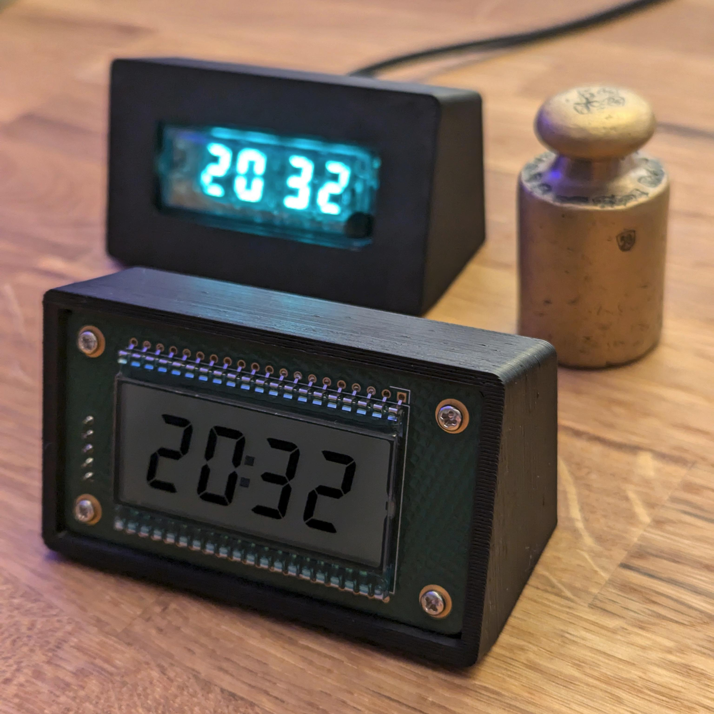

# enclosures

This is a small collection of 3D-printable cases designed in [Solvespace](https://solvespace.com/) to go with the chronovfd display.

* **vfdshell**: fits a vfddriver_v2 display from behind
  * screw with M2.5 directly into the plastic or use the `_deeper` variant which uses heat inserts
  * supposed to be standalone and driven with an [Adafruit QT Py](https://learn.adafruit.com/adafruit-qt-py-esp32-s3/overview) over the Stemma QT cable
  * it hides most of the PCB from the front and encloses the vacuum tube

* **frontmount**: screw in the display PCBs from the front
  * again, held in place with M2.5 screws and nuts that need to be pushed into pockets
  * rather designed for use with the lcddriver, which is powered by a coin cell and needs no additional microcontrollers or cables on the back

