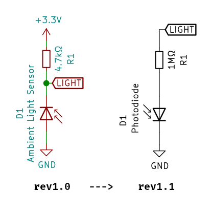

# Fix the ambient light sensor on rev 1.0 boards

The ambient light sensor in the form of a photodiode on D1 was added and placed
as one of the last components before ordering the first batch of PCBs. As such
I haven't actually calculcated how much of a voltage drop the diode would cause
and overlooked that the ADC of the ESP32 could not actually measure the
difference between 3.3V and 3.1V accurately.

To remedy this and move the measured voltage to the other side of the spectrum
closer to GND a small modification to the circuit board is necessary. The
modification is incorporated in revision 1.1 and the change is as follows:

That means:

* If already assembled, desolder `R1` and `D1`.
* Cut the trace between the footprints of `R1` and `D1` with a sharp tool.¹
* Solder `D1` back in reverse direction, so the diode's anode is on the cathode
  side of the footprint (in the silkscreen box).³
* Put a `1MΩ` resistor over the previously cut trace, connecting the diode's
  anode and the trace going to the ESP32.²
* The `+3.3V` pad of the `R1` footprint remains unpopulated!

## Pictures:

 cut the trace between D1 and R1")
 put a 1 megaohm resistor on these now-disconnected pads")
 top view showing the orientation of the vishay photodiode")