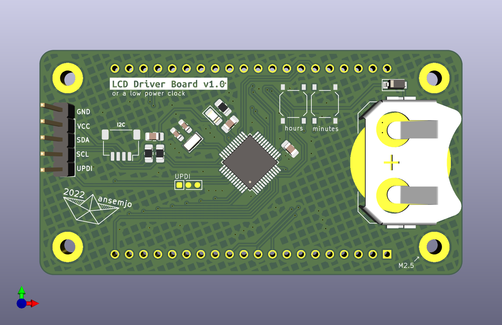
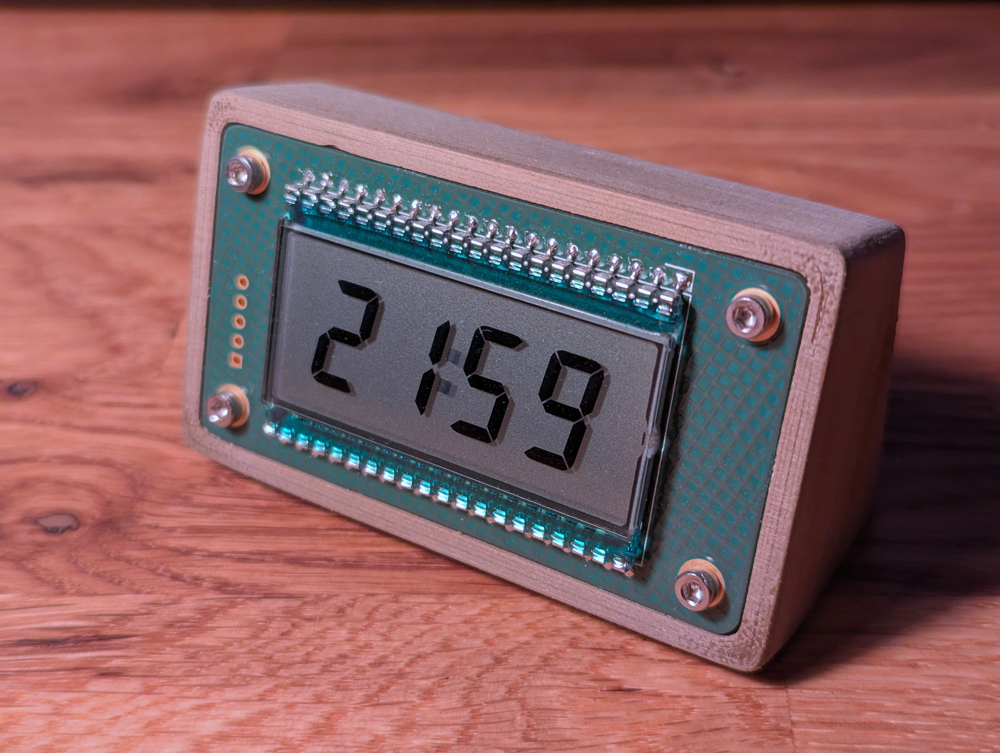

# lcddriver

This isn't entirely my own design and is instead heavily based on David Johnson-Davies' ["Low-Power LCD Clock" design on Technoblogy](http://www.technoblogy.com/show?19K8) (archived: [page](https://archive.ph/uYsL3), [firmware](https://archive.ph/4itl0)). This was created shortly after the `vfddriver` v2 and was meant to use the same physical format and I2C protocol to be a drop-in replacement. In practice, I haven't really bothered to write a separate firmware and used it as a standalone clock with David's firmware instead.




It just needed a few small modifications from the original:

* Only `PE0` is connected to the display's `COM`. `PE1` is used for an LED and if you use the firmware as-is, you'll have a constantly flashing LED.

* I used an **AVR32DB48** and apparently (?) it lacks some of the ADC stuff necessary to read its own voltage? So I just removed `ADCSetup()`, `DisplayVoltage()` and the references to it.

* Additionally, I removed the temperature display and reduced the blinking frequency of the colon by to 2 Hz.

There is also an inverted variant of the firmware, for when you want to operate the clock rotated by 180°, since the LCD segments are rotationally symmetric but the viewing angle is better from one side.

### Compile

The firmware is in `technoblogy-clock-firmware/`.

The chip [is supported](https://docs.platformio.org/en/latest/boards/atmelmegaavr/AVR32DB48.html) by PlatformIO but back when I tried this, I couldn't get it to work. I got either `Error: Unknown board ID 'AVR32DB48'` or `Error: This board doesn't support Arduino framework!`. Therefore I used the method that David used and installed the [DxCore](https://github.com/SpenceKonde/DxCore) in the Arduino IDE, which I then used to compile the firmware instead.

### Flashing

For some reason the Arduino GUI couldn't directly flash my chip. Probably something about a wrong Python version. I manually installed [`pymcuprog`](https://pypi.org/project/pymcuprog/) in a Python 3.9.12 environment and used:

```
pymcuprog write -d avr32db48 -t uart -u /dev/ttyUSB1 -f lcdclock.ino.hex
```

