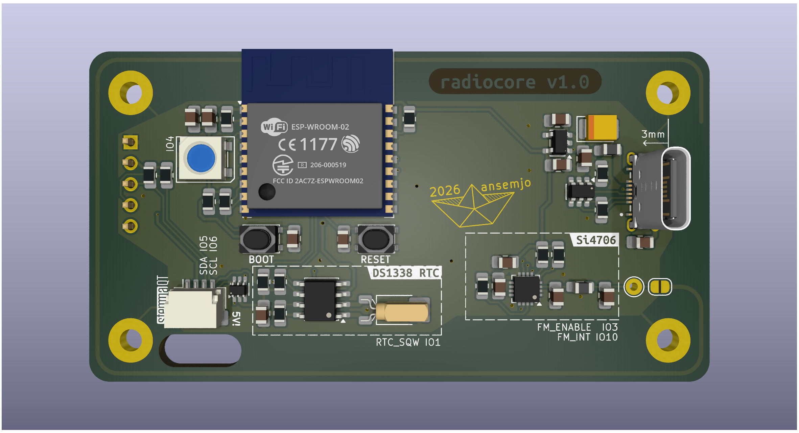
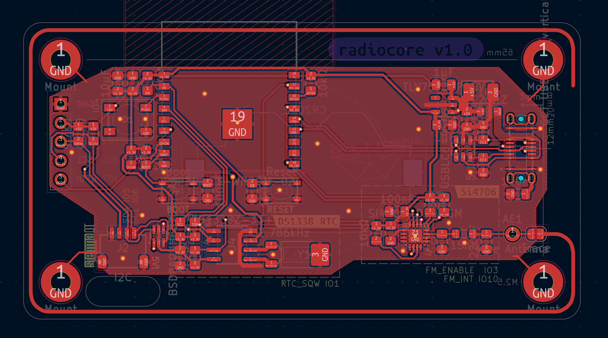

# radiocore
This is a redesign of the [`si4706_radio_eval`](../experiments/si4706_radio_eval/) experiment, meant to be a "clockcore v2" to control the standalone vfddriver.

Notably, it includes:

* **Skyworks Si4706** FM radio receiver with RDS decoder, to get time signal "from the air"
* **DS1338 RTC** with coin cell battery backup, to keep accurate time over long periods and without power
* **ESP32-C3** as a simple-to-program-over-USB controller chip, which conveniently *also* includes WiFi capability, if you prefer NTP over RDS
* vertical **GCT USB4145** USB-C connector, so a final assembly with two sandwiched boards will have the cable coming in from the back

_**2026-02-03:** I ordered the boards and am waiting to try if the CircuitPython firmware from the experiment will work on this chip as well._

