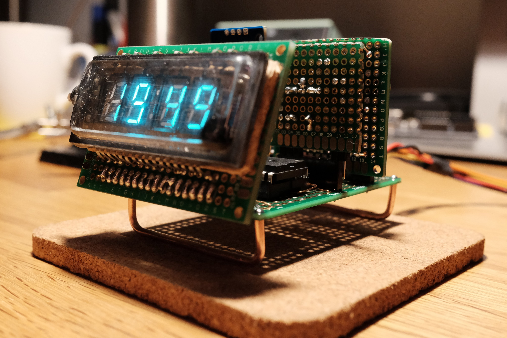
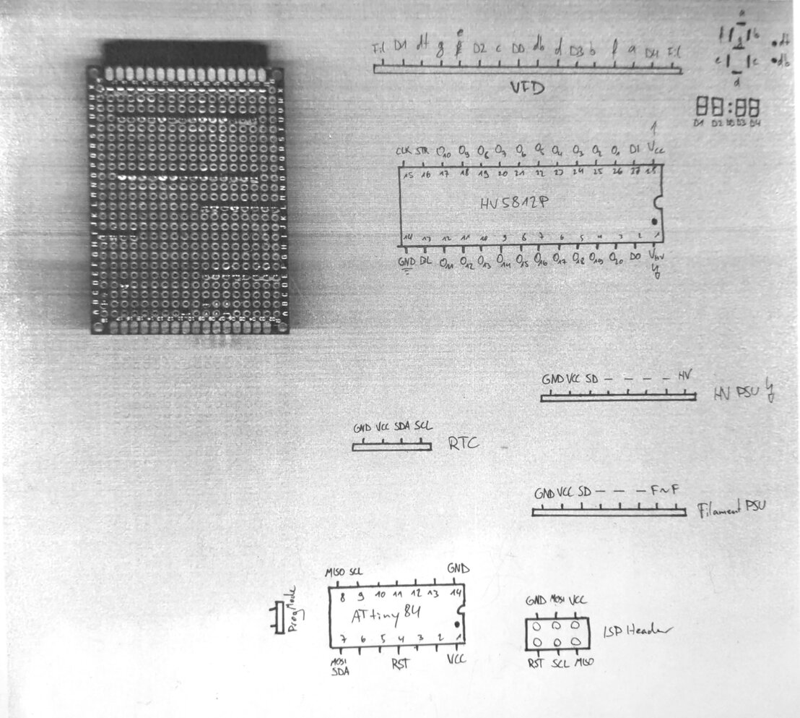

# protoclock

Since the fragile legs of the display are pretty hard to use in a breadboard, and also because I wanted to test the schematics for filament and 24V supplies, I constructed this prototype on multiple perfboards instead. The solder joints look horrible but it was my first working clock.

* There is a large carrier board, which holds the HV5812P DIP shift register and an ATtiny84 for control. Additionally, pin headers and enamelled wired connect all the other modules:
* the "high-voltage" (24V) power supply for the grids and anodes,
* a low-voltage AC power supply for the filament, based on a self-oscillating audio amplifier,
* a header for a DS3231 RTC with coin cell battery.

The [firmware](firmware/) supports two modes:

* With the jumper closed, the ATtiny drives the display as a standalone clock from the RTC.
* An open jumper makes the microcontroller a peripheral, so you can set the time on the RTC or drive the display directly over I2c.