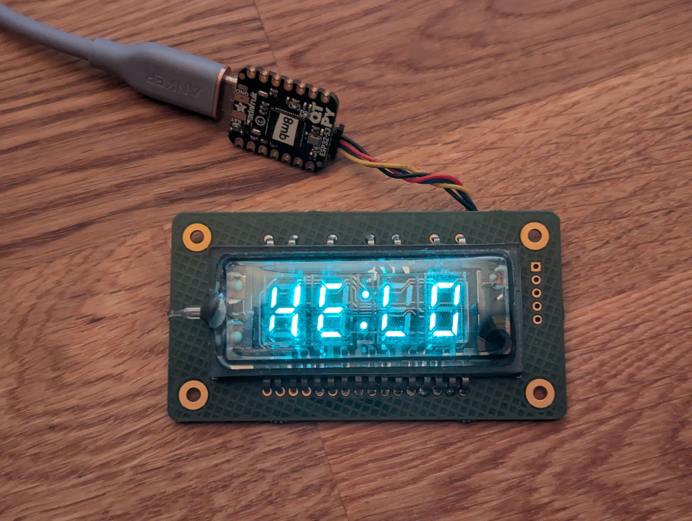
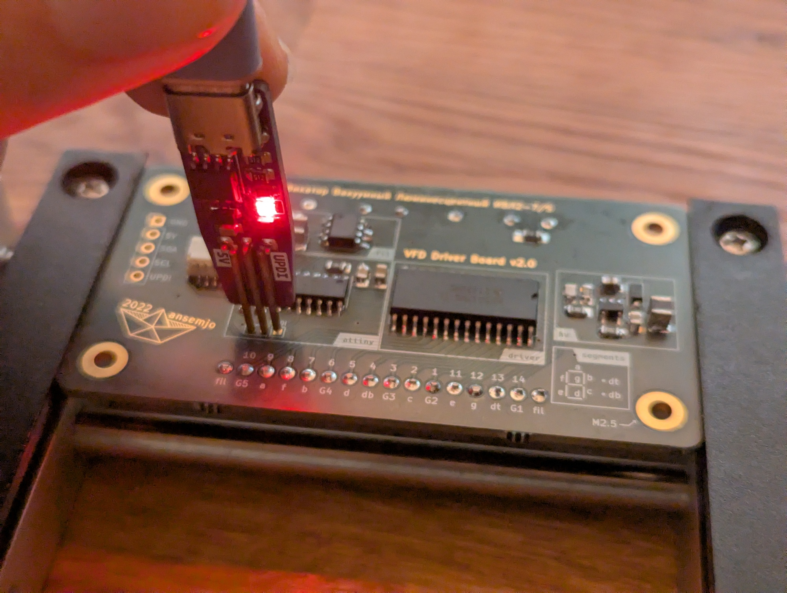

# vfddriver (v2)

A standalone driver board for four-digit IVL2-7/5 vacuum-flourescent display (VFD) tubes.



view: [schematic](https://kicanvas.org/?repo=https%3A%2F%2Fgithub.com%2Fansemjo%2Fchronovfd%2Fblob%2Fmain%2Fvfddriver%2Fvfddriver.kicad_sch) –
[circuit board](https://kicanvas.org/?repo=https%3A%2F%2Fgithub.com%2Fansemjo%2Fchronovfd%2Fblob%2Fmain%2Fvfddriver%2Fvfddriver.kicad_pcb) –
[firmware](firmware/) –
[parts list](https://www.digikey.de/de/mylists/list/2BJCAMLMTA) –
[ibom](https://htmlpreview.github.io/?https://github.com/ansemjo/chronovfd/blob/main/vfddriver/ibom.html)

## hardware

You can find a lot of fundamental information on VFD operating principles in [this excellent Noritake guide](https://www.noritake-elec.com/technology/general-technical-information/vfd-operation) ([archive](https://archive.is/BsdLR)). As a very brief overview, the filament is emitting electrons from a constant current, which are accelerated towards the positive grids over each segment and when the electrons hit a phosphor-coated segment, it starts glowing brightly.

* High-voltage (24V) for the grids and anodes is supplied using a simple [TI LM2733YMF](https://www.ti.com/lit/gpn/lm2733) boost converter.
* A [Microchip HV5812](https://ww1.microchip.com/downloads/aemDocuments/documents/OTH/ProductDocuments/DataSheets/20005629A.pdf) shift register with high-voltage MOSFET outputs is used to supply the grids and anodes with 24V, while being safe to use with 5V logic.
* The filament requires alternating current for best luminous uniformity. This is provided by a [Diodes Inc. ZXBM5210](https://www.diodes.com/datasheet/download/ZXBM5210.pdf) (or equivalently, [Rohm BD6211F](https://fscdn.rohm.com/en/products/databook/datasheet/ic/motor/dc/bd621x-e.pdf)) H-bridge motor driver by toggling the FWD/REV direction pins and using Vref to adjust the effective RMS voltage, which directly influences the overall brightness.
* Everything is controlled using an [AVR ATtiny414 microcontroller](https://www.microchip.com/en-us/product/attiny414), which acts as a peripheral on an I2C bus. Since the segments on all digits are connected, it needs to use time-multiplexing over the grids and constantly refresh the shift-register sufficiently quickly for a smooth appearance. The AVR also translates received ASCII characters to the actual segment anodes.


So far, I have ordered the PCBs from [AISLER.net](https://aisler.net/), who produce locally (to me) using the pretty gold ENIG finish and accept KiCAD files directly. Parts were [ordered from DigiKey](https://www.digikey.de/de/mylists/list/2BJCAMLMTA) and assembly was done by hand using the [interactive BOM viewer](https://htmlpreview.github.io/?https://github.com/ansemjo/chronovfd/blob/main/vfddriver/ibom.html).

### segments

In the render above, you can see the HV5812 pin numbering and mapping to grids (`G1`, `G2`, `Gc`, `G3`, `G4`) and segments (`a`–`g`, `db`, `dt`), with pin 1 being the "latest" shifted bit:

|anode|G4|a|f|b|G3|d|db|Gc|c|G2|e|g|dt|G1|
|-|-|-|-|-|-|-|-|-|-|-|-|-|-|-|
|**pin**|10|9|8|7|6|5|4|3|2|1|11|12|13|14|

For convenience, here is the same table in terms of bits in a `u16`:

|anode|G1|dt|g|e|G4|a|f|b|G3|d|db|Gc|c|G2
|-|-|-|-|-|-|-|-|-|-|-|-|-|-|-|
|**bit**|13|12|11|10|9|8|7|6|5|4|3|2|1|0|

The segments in a digit are counted clockwise, starting from the top; the center dash is last and the two dots in the colon can be adressed individually as well:

```
      a            a                a            a     
    ────         ────             ────         ────    
 f │    │     f │    │     dt  f │    │     f │    │   
   │  g │ b     │  g │ b   ■     │  g │ b     │  g │ b 
    ────         ────             ────         ────    
 e │    │     e │    │     db  e │    │     e │    │   
   │  d │ c     │  d │ c   ■     │  d │ c     │  d │ c 
    ────         ────             ────         ────    
                                                        
     G1           G2       Gc       G3           G4     
```

## firmware

The firmware was ported to Rust using the [`avr-none`](https://doc.rust-lang.org/stable/rustc/platform-support/avr-none.html) target and [`rahix/avr-device`](https://github.com/Rahix/avr-device) crate. Even though this is effectively still register-fiddling, since there currently is no proper HAL for ATtiny 0/1-series chips, the development experience was much more pleasant already.
*(Note: the previous C firmware can be found in [commit `2b87ed3`](https://github.com/ansemjo/chronovfd/tree/2b87ed39b4a0b78c596b9a6d270321534c5b3cb9/vfddriver/firmware), though it has fallen behind feature-wise.)*

### building

I am not exactly sure what the absolute minimum required version is for a successful build. But I can say that the firmware easily builds in a current `rust:trixie` container.

You should be able to just run `cargo build` after installing `gcc-avr` and `avr-libc`. The resulting `firmware.elf` then just needs to be converted to a HEX file using `avr-objcopy` before flashing.

```
$ docker run --rm -it -v firmware/:/firmware -w /firmware rust:latest

# apt update && apt install -y gcc-avr avr-libc
// binutils-avr amd64 2.43.50.20250108-1
// gcc-avr amd64 1:14.2.0-2
// avr-libc all 1:2.2.1-1

# cargo build
info: syncing channel updates for 'nightly-x86_64-unknown-linux-gnu'
info: latest update on 2026-01-31, rust version 1.95.0-nightly (a293cc4af 2026-01-30)
// ...
    Finished `dev` profile [optimized + debuginfo] target(s) in 26.26s

# avr-objcopy -O ihex -R .eeprom target/avr-none/debug/firmware.{elf,hex}
# avr-size target/avr-none/debug/firmware.hex
   text	   data	    bss	    dec	    hex	filename
      0	   3658	      0	   3658	    e4a	firmware.hex
```

A compiled firmware is also committed in this repository, though I won't guarantee that I will always keep it updated with every commit. (:

### flashing

The ATtiny 0/1/2-series chips can be flashed using an UPDI programmer, which can be as simple as connecting a Schottky diode or resistor between the RX and TX pins of a USB-TTL adapter: [SpenceKonde/AVR-Guidance/UPDI/jtag2updi.md](https://github.com/SpenceKonde/AVR-Guidance/blob/master/UPDI/jtag2updi.md#connections). I have my own programmer based on a CH340N chip, very similar to [this pogo pin adapter](https://oshwlab.com/gabe_9484/usb-c-to-updi).

Using serial adapters like this, you can then use [`pymcuprog`](https://pypi.org/project/pymcuprog/) to flash the firmware:

```
pymcuprog -d attiny414 -t uart -u /dev/ttyUSB0 write \
 --erase -f firmware/target/avr-none/debug/firmware.hex
```



### configuration

For persistent configuration, you can write values to the ATtiny414's USERROW — a special region in the EEPROM (`0x1300`), which is not deleted when flashing new firmware. You can again use `pymcuprog` to set these values. Erasing the region or writing a `0xff` always means "use hardcoded defaults", since this is the default when you haven't modified the USERROW.

```
pymcuprog -d attiny414 -t uart -u /dev/ttyUSB0 write \
 -m user_row -o 0x01 -l 160 # default brightness
```

| Offset | Type | Default | Description |
| ------ | ---- | --------| ----------- |
| `0x00` | `u8` | `0x68` | I2C peripheral address |
| `0x01` | `u8` | 120 | filament brightness (DAC value) |
| `0x02` | `u16` | 10.000 | digit multiplexing frequency in Hz |
| `0x0b` | `[u8; 5]` | `0xff..ff` | initial display contents |
| `0x10` | `[u8; 16]` | `[0, 1, 2, 3, 4]` | grid multiplex loop |

The grid multiplex loop can be used to adjust the relative brightness of grids, if they do not light up evenly. For example, if your first and last digits are darker at the edges, write:

```
pymcuprog -d attiny414 -t uart -u /dev/ttyUSB0 write \
 -m user_row -o 0x10 -l 0 0 1 2 3 4 4 0xff
```

## usage

The default I2C address of the display is `0x68`. Since the primary usage will be writing new display contents, the firmware will try to parse *most* bytes as bare numbers, ASCII characters or raw segment bitmaps. There are only two special command sequences which change the behaviour with the first transmitted byte; otherwise the display always expects exactly five bytes for the new display contents, from left to right, with the colon in the middle.

```
# HE LO
i2c.writeto(0x68, "HE LO")
```

#### commands

The two commands currently are:

* `[ 0x10, <u8> ]`: adjust display brightness with a new filament DAC value
* `[ 0x7f ]` (ASCII `DEL`): clear display (all segments off)

Future additions will probably use the non-printable range after `0x10`.

#### bare numbers

The byte values `0x00` to `0x09` are simply interpreted as decimal numbers.

So `[ 0x01, 0x02, 0x00, 0x03, 0x04 ]` would display `12 34`.

#### segment bitmap

The non-printable range above `0x80` is treated as raw bitmaps to the segments. To make it easier to think about, the bits are mapped from "left to right" (MSB to LSB) in the same clockwise order as they are named `a` to `g`: `0b1abcdefg` (bits `b` and `c` additionally map to `dt` and `db`).

Showing the "identical to" symbol `≡` with three horizontal bars could therefore be done by transmitting:

```
  1abcdefg
0b11001001
```

#### characters

All the remaining bytes are mapped from the ASCII characters, where possible. Since the digits are only sevent-segments digits, you can't really display the full alphabet well; for the colon only `:`, `.` and ` ` are really useful, etc. But this also allows you to simply format a `HH:MM` string with the time on your controller and transmit that as bytes.

#### examples

A few more examples that you might use from CircuitPython:

```
# 23:59
i2c.writeto(0x68, "23:59")
i2c.writeto(0x68, bytes([2, 3, 0xff, 5, 9]))
# 20°C
i2c.writeto(0x68, "20 *C")
```

```
# An.on                    A     n        .        o     n
i2c.writeto(0x68, bytes([0x41, 0x6e, 0b10010000, 0x6f, 0x6e]))
```

```
# lower brigthness
i2c.writeto(0x68, bytes([0x10, 65]))
```